# Cloud Workshop AWS + Fortinet SDWAN
@NetDevOps, @SDWAN, @AWS Transit Gateway, @disponibilidad global

## Objetivo del laboratorio
El objetivo de este laboratorio es dar nociones sobre cómo desplegar una infraestructura relativamente compleja de hub y spoke en AWS integrado con el servicio de conectividad de Transit Gateway (TGW). El laborotario hace uso de los siguientes componenetes de AWS:

- AWS TGW desdplegados en dos regiones.
- AWS TGW peering entre los dos TGW desplegados. 
- AWS TGW route tables para diferenciar tráfico de pre y post inspección por los Fortigates.
- AWS TGW attachment connect para habilitar routing dinámico BGP entre el cluster de Fortigate y AWS. 
- Amazon Route53. 

En esta guia encontrarás los pasos para realizar el laboratorio. El portal del mismo con los detalles para poder desplegar los recursos necesarios y el leader board para comprobar si todo los has realizado correctamente, están en la siguiente URL:

https://www.fortidemoscloud.com

> [!NOTE]
> Debes introducir el token proporcionado

## Lab T1. Resumen puesta en marcha

El participante desplegará los siguientes recursos sobre AWS:
- 1 x VPC con un CIDR diferente por participante preestablecido para desplegar la instancia de fortigate y servidor bastion. 
- Los Security Groups (SG) que se asociarán a cada una de las interfaces. 
- 1 x fortigate con los interfaces necesarios en cada subnet, sus SG asociados y la configuración SDWAN necesaria para conectar al HUB.
- Es necesario actualizar las variables proporcianadas en el [portal](https://wwww.fortidemoscloud.com) para poder desplegar el código. 
- El código Terraform que se proporciona en el laboratorio, se basa en los módulos creados para desplegar servicios Fortinet en AWS. [AWS Fortinet Modules](https://github.com/jmvigueras/terraform-ftnt-aws-modules). 
- No es necesario ningúna aplicación especifica en el PC o tener una suscripción a AWS.

> [!NOTE]
> Los detalles de despliegue son diferentes para cada participante.

## Diagrama del laboratorio

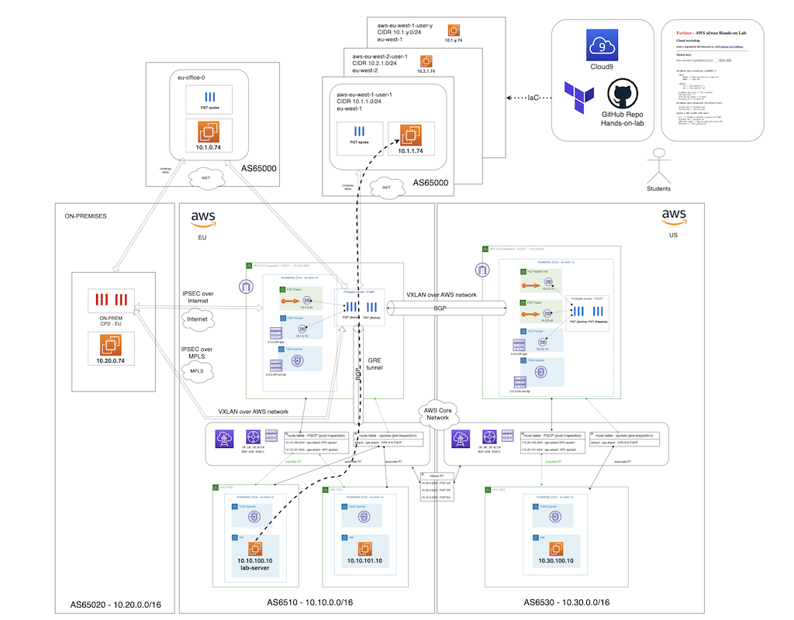


# LAB
## Pasos a seguir:

## 1. Conexión al entorno de desarrollo Cloud9
Desde el [portal formación](http://www.fortidemoscloud.com) puedes encontrar el detalle para acceder a tu IDE AWS Cloud9.

1.1 Obtener los datos de cada usuario:
- Desde el portal de formación introduce el email de registro al curso.
- Apareceran los datos asociados para usar durante el laboratorio.
- Acceder a la URL del portal Cloud9 que aparece con los datos de: `AWS Account ID`,  `IAM user` y `Password`. 

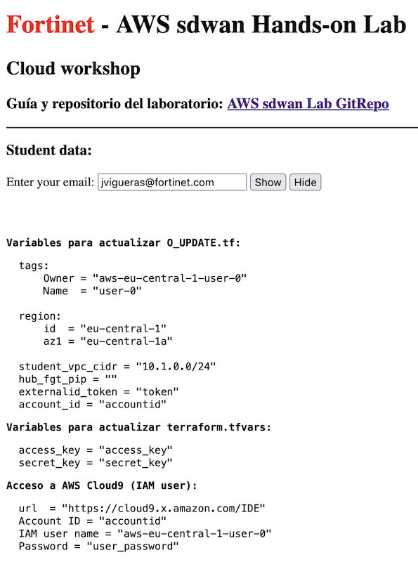

- Ejemplo:
  - URL acceso: https://eu-central-1.console.aws.amazon.com/cloud9/ide/d77xxxxx
  - AWS Account ID: xxxxxx
  - IAM user name: aws-eu-west-1-user-1
  - Password: xxxxx

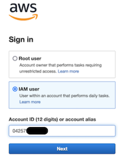

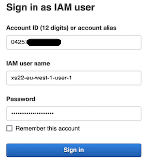


## 2. Clonar repositorio desde GitHub
- Abrir una nueva consola terminal o usar la actual.
- Desde el terminal ejecutar el siguiente comando: 
```
git clone https://github.com/jmvigueras/sdwan-aws-hands-on-lab.git
```
- ... o desde el botón de Git que se puede encontrar e introduciendo la URL anterior

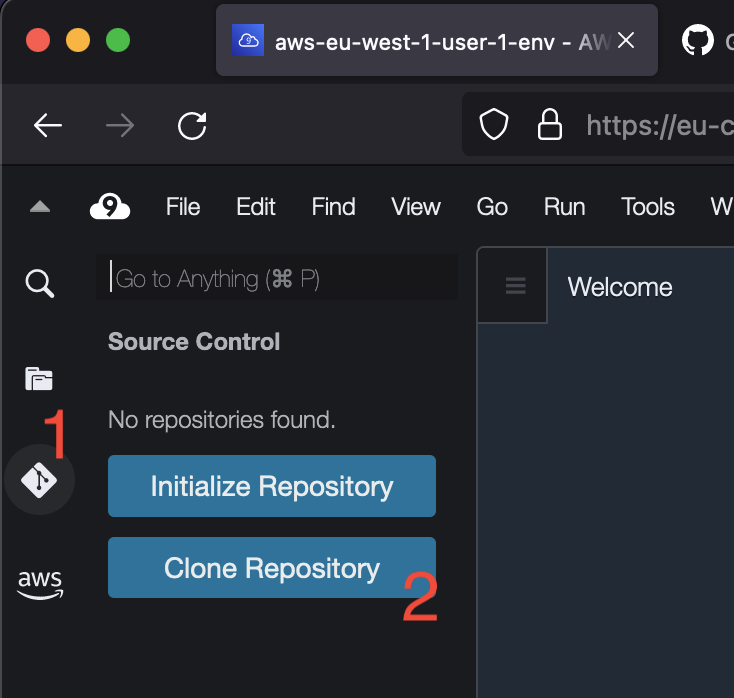

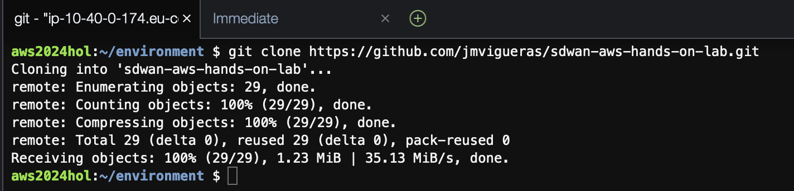


## 3.  Acceder a la carpeta T1_day0_deploy-vpc
- Desde el terminal 
```
cd sdwan-aws-hands-on-lab/terraform
```
- Desde el navegador de ficheros de la parte izquierda desplegando la carpeta correspondiente al T1

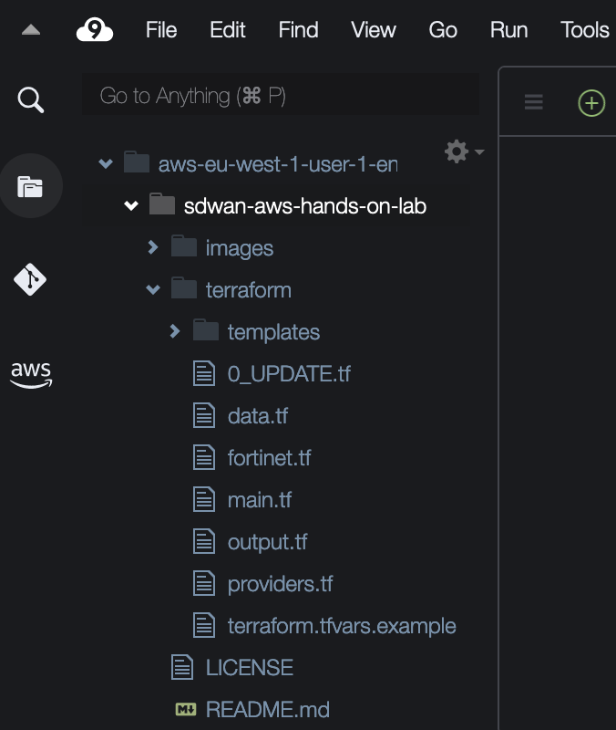


## 4. **IMPORTANTE** Actualizar las variables locales necesarias para este primer laboratorio
- Las variables locales se deben actualizar con los datos únicos para cada participante.
- Los datos se obtinen desde el [portal formación](https://www.fortidemoscloud.com) 
- Hacer doble click en el fichero **0_UPDATE.tf** desde el explorador de ficheros.
- Actualizar las siguientes variables con los datos de cada participante.
```sh
  # Unique User ID (same as IAM user name)
  user_id = "aws-eu-west-1-user-0"

  # Region and Availability Zone where deploy VPC and Subnets
  region = "eu-west-1"

  # CIDR range to use for your VCP: 10.1.x.x group 1 - 10.1.1.0/24 user-1
  user_vpc_cidr = "10.1.0.0/24"

  # Lab token (update with lab token received by email)
  externalid_token = "<token-lab-send-by-email>"

  # AWS account_id
  account_id = "04xxx"
}
```
> [!WARNING]
> Recuerda guardar el fichero con los cambios realizados

Nota: los rangos cidr están repartidos para cada participante y no se solapan, para lo que se ha seguido la siguiente nomenclatura:

 - 10.1.x.x asignado a la region west-1
 - 10.2.x.x asignado a la region west-2
 - ...
 - 10.1.0.0/24 asignado al user 0 en la region west-1
 - 10.2.1.0/24 asignado al user 1 en la region west-2
 - ...

## 5. **IMPORTANTE** - Actualizar las credenciales de acceso programático que usará Terraform para el despliegue
- Hacer doble click en el fichero **terraform.tfvars.example** desde el explorador de ficheros.
- Actualizar las variables con los datos proporcionados en el [portal formación](https://www.fortidemoscloud.com) 
```
access_key          = "<AWS Access Key>"
secret_key          = "<AWS Secret Key>"
```
- Las variables deben quedar configuradas con el siguiente patrón: access_key="Axxxxxxxxx"
- Cambiar el nombre al fichero `terraform.tfvars.example` a `terraform.tfvars`

(Recuerda guardar el fichero con los cambios realizados)

## 6. **Despligue** 

* Inicialización de providers y módulos:
  ```sh
  $ terraform init
  ```
* Crear un plan de despliegue y 
  ```sh
  $ terraform plan
  ```
* Comprobación que toda la configuración es correcta y no hay fallos.
* Desplegar el plan.
  ```sh
  $ terraform apply
  ```
* Comprobar que se van a desplegar los recursos esperados en el plan.

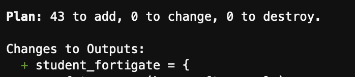

* Confirmar despliegue, type `yes`.

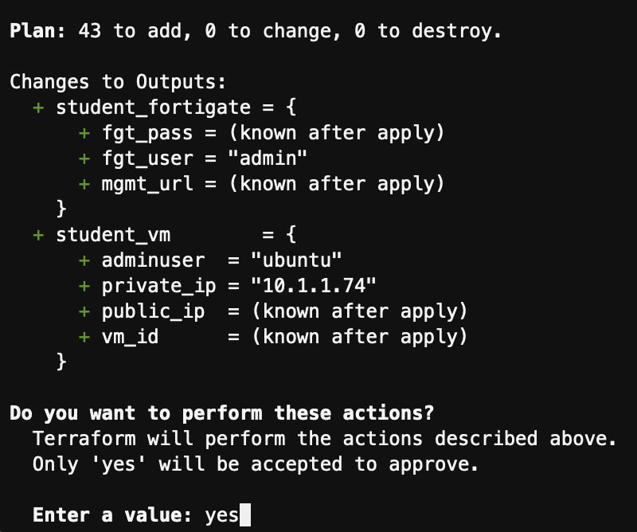

* Si todo funciona correctamente se generará una salida con el resumen del plan de despliegue y las variables de output configuradas:

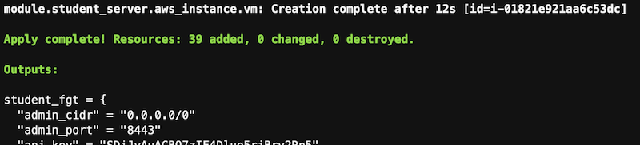

## 7. Comprobar conectividad

### 7.0. ¿Cómo acceder al Fortigate?
- En el output del despligue de terraform, puedes encontrar la URL para acceder al mismo. ("mgmt_url" = https://<ip_management>:8443) 
- Al acceder solicitará resetear la contraseña. La contraseña inicial es el ID de la instancia EC2 del fortigate, que puedes consultar desde la consola de AWS o en el output del terraform. 

### 7.1. Comprobación de conectividad a HUB y contra servidor local

- Comprobación de la correcta conexión al HUB
```sh
get router info bgp summary
get router info routing-table bgp
get router info bgp neighbors 172.16.100.1 ad
get router info bgp neighbors 172.16.100.1 ro
```


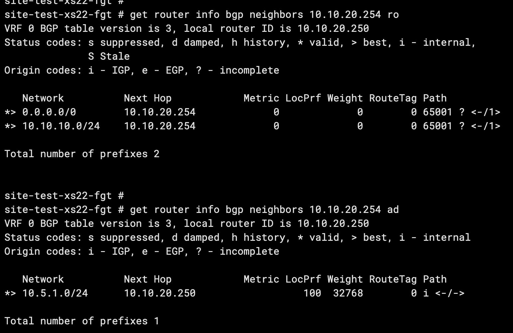

- Conexión local contra el servidor (ejecutar desde consola Fortigate)
```sh
execute ping 10.x.x.74
execute telnet 10.x.x.74 80
diagnose sniffer packet any 'host 10.x.x.74' 4
```
Nota: recuerda que la IP de tu servidor depende de tu rango CIDR asignado: 
ej. 10.1.1.74 asignado al user 1 en la region west-1
ej. 10.2.5.74 asignado al user 5 en la region west-2

7.2 Comprobar que vuestro usuario ya aparece en la Leader Board del portal

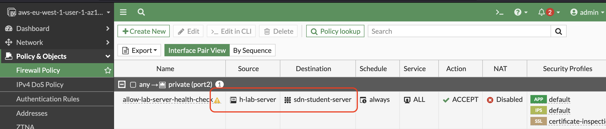


7.3 Actividad extra

- Conforme el resto de compañeros vayan desplegando sus Fortigates, se irán uniendo la red SDWAN, por lo que vuestro spoke irá aprendiendo nuevas rutas contra las redes que anuncian. (Red iBGP con HUB haciendo de Route Reflector)
- Comprobar la conectividad mediante ADVPN a las redes de los compañeros. Pregunta a algún compañero la IP de sus servidor interno e intenta hacer ping desde el Fortigate o desde vuestro servidor de laboratorio. (Ej. Puedes hacer ping a la IP del servidor de test del usuario 0 10.1.0.74)
- Comprobar que se levanta un nuevo túnel de forma dinámica. 

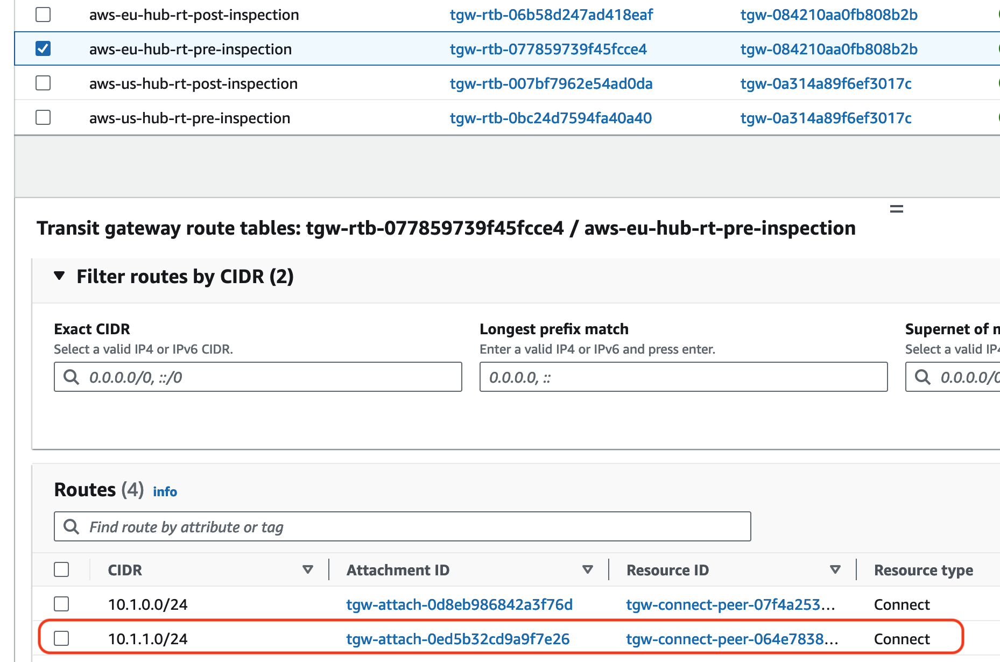

## Laboratorio completado
Enhorabuena!

## Support
This a personal repository with goal of testing and demo Fortinet solutions on the Cloud. No support is provided and must be used by your own responsability. Cloud Providers will charge for this deployments, please take it in count before proceed.

## License
Apache License [License](.LICENSE)


