# Lab README

## Laboratory Objective
The objective of this workshop is to provide insights on deploying a relatively complex hub-and-spoke infrastructure in AWS integrated with the Transit Gateway (TGW) connectivity service. Following AWS components will be used:

- AWS TGW deployed in two regions.
- AWS TGW peering between the two deployed TGWs.
- AWS TGW route tables to differentiate pre and post-inspection traffic through Fortigates.
- AWS TGW attachment connect to enable dynamic BGP routing between the Fortigate cluster and AWS.
- Amazon Route53.

In this guide, you will find the steps to perform the laboratory. The portal with details to deploy the necessary resources and the leaderboard to check if everything is done correctly can be accessed at the following URL:

[https://www.fortidemoscloud.com](https://www.fortidemoscloud.com)

> [!NOTE]
> You must enter the provided token.

## Lab T1. Deployment Summary

The participant will deploy the following resources on AWS:
- 1 x VPC, with a unique CIDR per participant. This is where the Fortigate instance and a test or bastion server will be deployed.
- Security Groups (SG) for the interfaces.
- 1 x Fortigate with the necessary interfaces in each subnet, associated SGs, and the required SDWAN configuration to connect to the HUB.

- The Terraform code provided in the laboratory is based on modules created to deploy Fortinet services on AWS. [AWS Fortinet Modules](https://github.com/jmvigueras/terraform-ftnt-aws-modules).
- It is necessary to update the variables provided on the [portal](https://www.fortidemoscloud.com) to deploy the code.
- No specific application on the PC or an AWS subscription is required.

> [!NOTE]
> Deployment details are different for each participant.

## Laboratory Diagram


# LAB
## Steps to Follow:

## 1. Connect to the Cloud9 Development Environment
From the [training portal](http://www.fortidemoscloud.com), you can find details on how to access your AWS Cloud9 IDE.

1.1 Get the user data:
- Enter the course registration email on the training portal.
- The associated data for use during the laboratory will appear.
- Access the Cloud9 portal URL provided with the data: `AWS Account ID`, `IAM user`, and `Password`.


- Example:
  - Access URL: https://eu-central-1.console.aws.amazon.com/cloud9/ide/d77xxxxx
  - AWS Account ID: xxxxxx
  - IAM user name: aws-eu-west-1-user-1
  - Password: xxxxx


> [!NOTE]
> Connection to Cloud9 is optional if the participant prefers to conduct the lab from their own PC. The necessary tools are `git` and `terraform`.

## 2. Clone Repository from GitHub
- Open a new terminal console or use the existing one.
- Execute the following command from the terminal:
```sh
git clone https://github.com/jmvigueras/sdwan-aws-hands-on-lab.git
```
- ... or from the Git button that can be found at the left menu and entering the previous URL.


## 3.  Go to folder sdwan-aws-hands-on-lab

- From the terminal:
```
cd sdwan-aws-hands-on-lab/terraform
```
- From the file explorer on the left menu, expanding the folder corresponding to `sdwan-aws-hands-on-lab`


## 4. **IMPORTANTE** Update local variables is mandatory for deploying. 

- Local variables must be updated with unique data for each participant.
- The data is obtained from the [training portal](https://www.fortidemoscloud.com).
- Double-click on the file **0_UPDATE.tf** in the file explorer.
- Update the following variables with participant data.

```sh
  # Unique User ID (same as IAM user name)
  user_id = "aws-eu-west-1-user-0"

  # Region and Availability Zone where deploy VPC and Subnets
  region = "eu-west-1"

  # CIDR range to use for your VCP: 10.1.x.x group 1 - 10.1.1.0/24 user-1
  user_vpc_cidr = "10.1.0.0/24"

  # Lab token (update with lab token received by email)
  externalid_token = "<token-lab-send-by-email>"

  # AWS account_id
  account_id = "04xxx"
}
```
> [!WARNING]
> Remember to save the file with the changes made (white dot on the tab).

Note: CIDR ranges are distributed for each participant and do not overlap, following pattern have been applied:

 - 10.1.x.x to region west-1
 - 10.2.x.x to region west-2
 - ...
 - 10.1.0.0/24 for user 0 to region west-1
 - 10.2.1.0/24 for user 1 to region west-2
 - ...

## 5. **IMPORTANT** - Update programmatic access credentials that Terraform will use for deployment

- Double-click on the file **terraform.tfvars.example** in the file explorer.
- Update the variables with the data provided on the [training portal](https://www.fortidemoscloud.com)

- The variables should be configured with the following pattern: access_key="Axxxxxxxxx"
- Change the name of the file `terraform.tfvars.example` to `terraform.tfvars`

> [!WARNING]
> Remember to save the file with the changes made (white dot on the tab).

## 6. **Deployment** 

* Install Terraform:
  ```sh
  $ sudo yum install -y yum-utils shadow-utils
  $ sudo yum-config-manager --add-repo https://rpm.releases.hashicorp.com/AmazonLinux/hashicorp.repo
  $ sudo yum -y install terraform
  ```
* Init providers and modules:
  ```sh
  $ terraform init
  ```
* Create an apply plan: 
  ```sh
  $ terraform plan
  ```
* Check that all the configuration is correct and there are no errors.
* Deploy the plan.
  ```sh
  $ terraform apply
  ```
* Verify that the expected resources will be deployed in the plan.


* Confir deployment, type `yes`.

* If everything works correctly, a summary of the deployment plan and configured output variables will be generated:


> [!NOTE]
> In the latest version of the Terraform AWS provider, there is an error at the end of the plan execution.

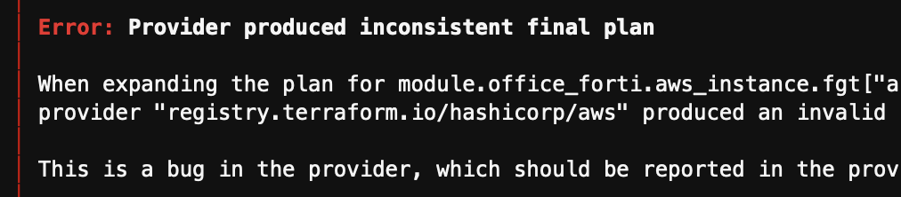

In this case, rerun the terraform apply to complete the execution.
  ```sh
  $ terraform apply -auto-approve
  ```

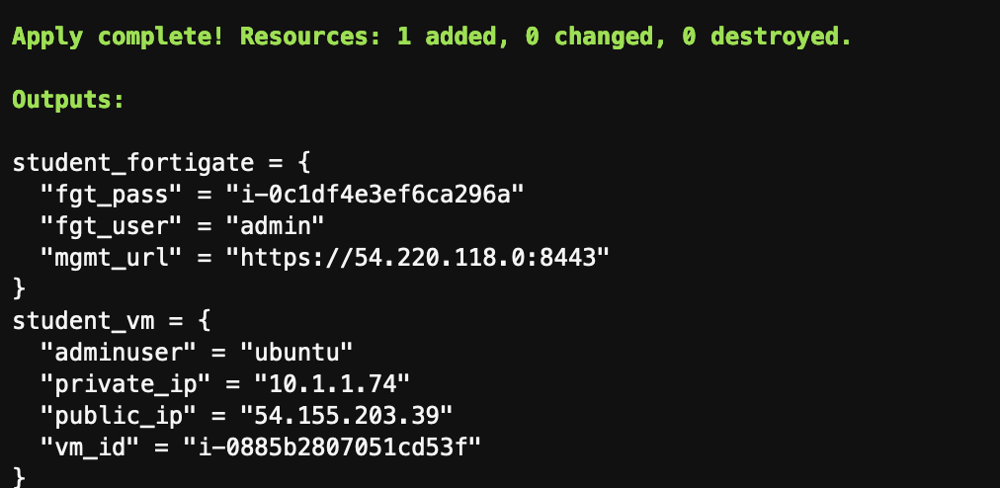

## 7. Check Connectivity

### 7.0. How to access to Fortigate firewall?

- In the output of the terraform deployment, you can find the URL to access the device. ("mgmt_url" = https://<ip_management>:8443) 
- Upon access, it will prompt to reset the password. The initial password is the EC2 instance ID of the Fortigate, which you can find in the AWS console or in the terraform output.

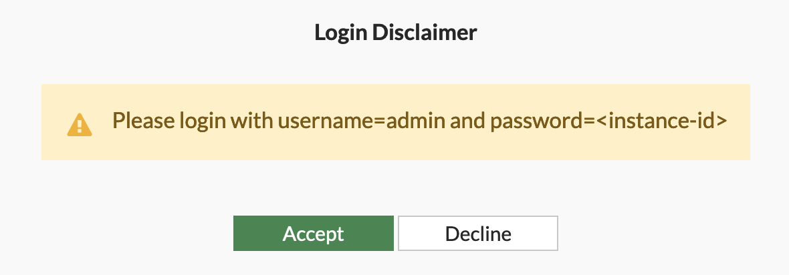

- Resetear password:

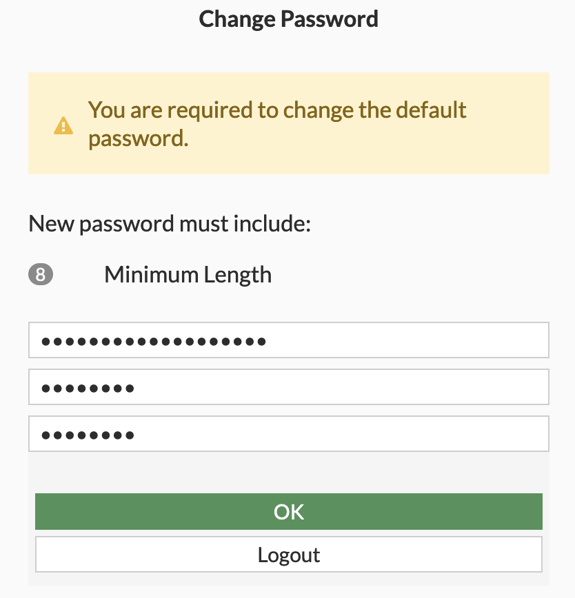

### 7.1. Checking Connectivity to HUB and Local Server

- Verify the successful connection to the VPN HUB:

**Via GUI**

- From the `Dashboard` menu > `Network` > IPSEC or SD-WAN panel:

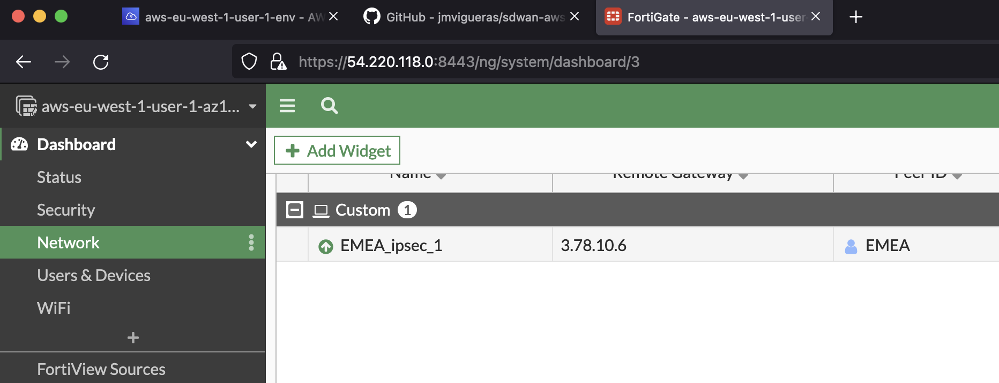

- From the `Dashboard` menu > Network panel > Routing panel:

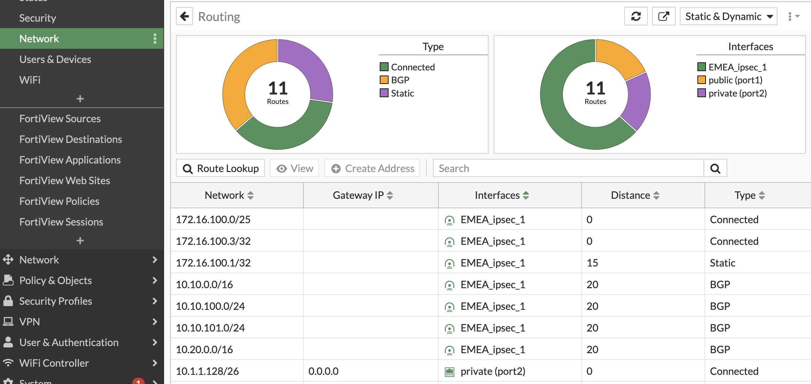

- From the `Network` menu > `SD-WAN`:

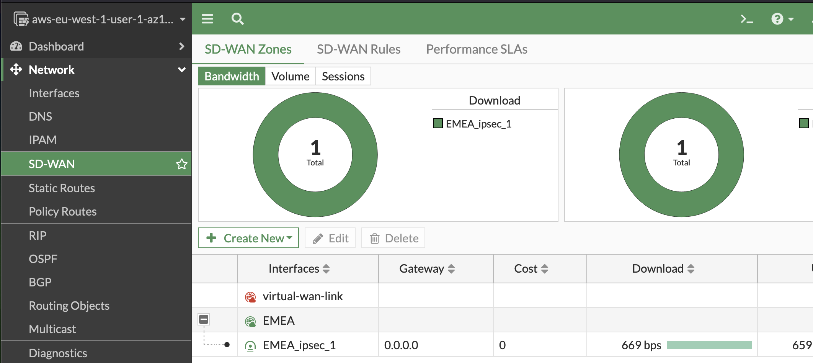

**Via CLI**

- You can open one or multiple console terminals from the GUI:

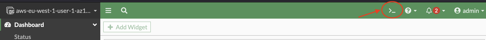

- Interesting commands for troubleshooting:
```sh
get router info bgp summary
get router info routing-table bgp
get router info bgp neighbors 172.16.100.1 ad
get router info bgp neighbors 172.16.100.1 ro
```
- Local connection to the server (execute from Fortigate console)
```sh
execute ping 10.x.x.74
execute telnet 10.x.x.74 80
diagnose sniffer packet any 'host 10.x.x.74' 4
```
Note: Remember that the IP of your server depends on your assigned CIDR range:
e.g., 10.1.1.74 assigned to user 1 in region west-1
e.g., 10.2.5.74 assigned to user 5 in region west-2

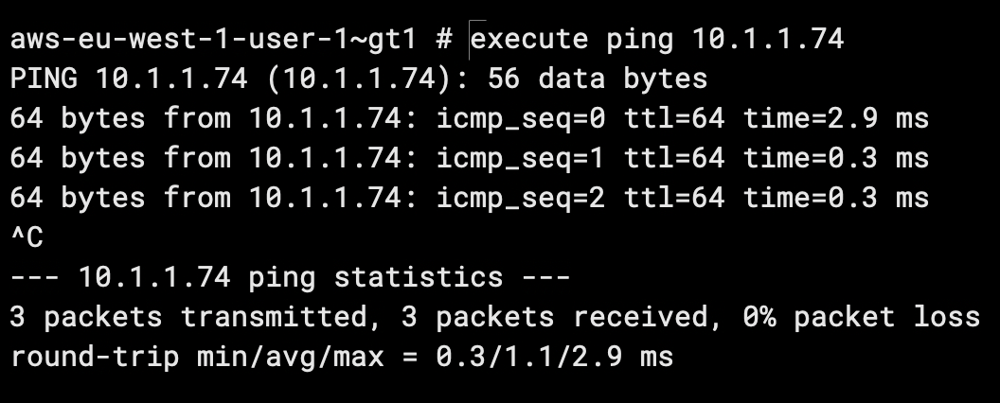

### 7.2 Check that Your User Appears on the Portal's Leader Board

> [!NOTE]
> If you have deployed without modifying any additional parameters, your user will not yet appear on the Leader Board. This is because a firewall rule has been configured with a dynamic object as the destination, pointing to a tag on your server, but it is NOT configured correctly.

Go to the security policies section `Policy & Objects` > `Firewall Policy`. From there, you will see the first rule configured with an alert icon indicating the problem. (I recommend using the `By Sequence` view, which you can activate on the right side).


To update the value of the dynamic object, you can do it directly from the `Firewall Policy` section by hovering over the `sdn-student-server` object and clicking `Edit`, or from the `Policy & Objects` > `Addresses` menu.

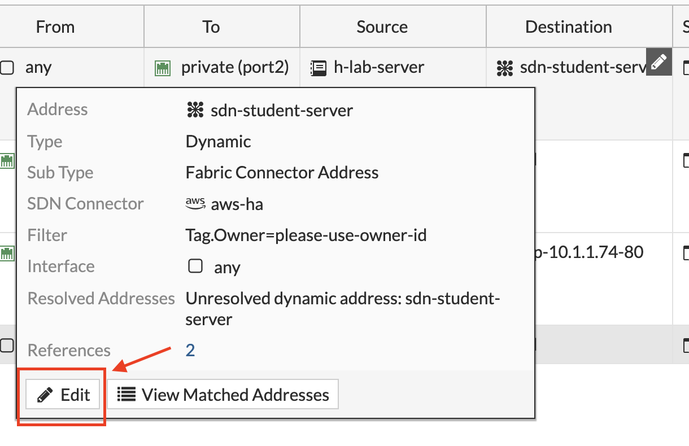

Select the correct TAG with your username in the filter of the dynamic object.

```sh
Tag.Owner=aws-eu-west-x-user-y
```

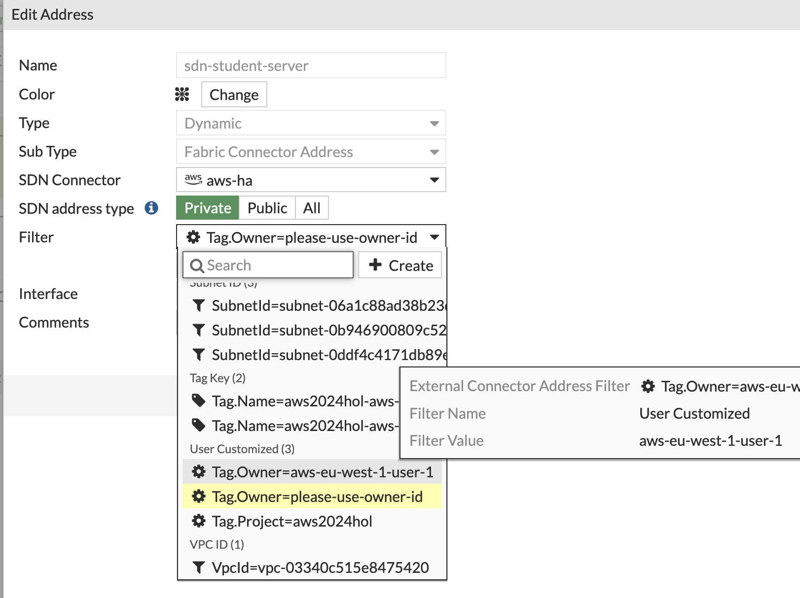

Once you update the object with your user's Owner Tag, the connector will resolve instances assigned with that Tag. In this lab, you will also see the IPs assigned to the Fortigate firewall instance.

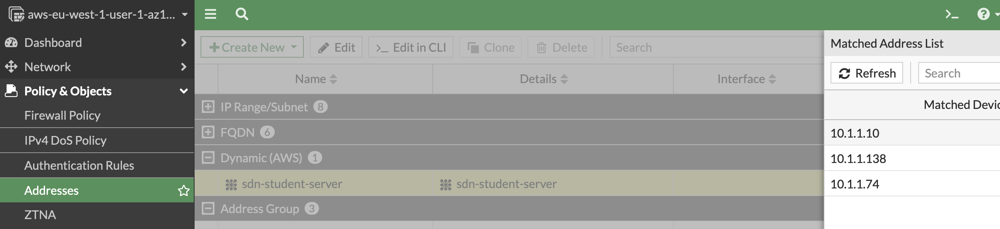

This way, the policy allowing traffic from the laboratory server to your test server will correctly match the IP and allow the health-check performed from it. (You should already observe traffic in the rule).

And your user should now appear on the Leader Board:

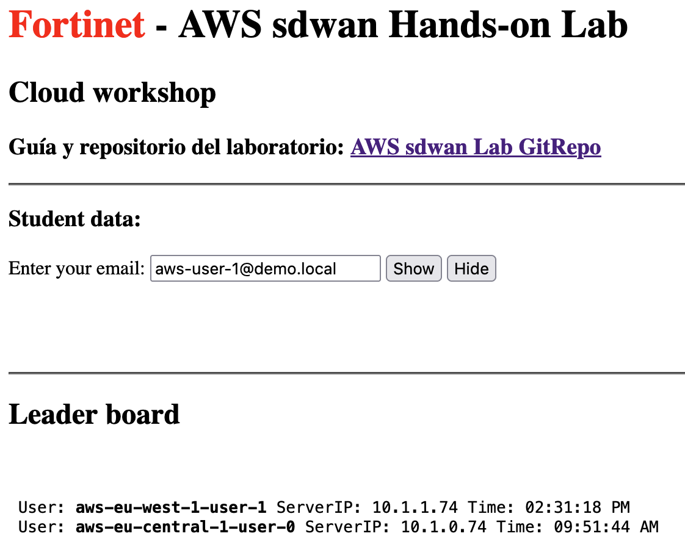

At this point, connectivity between the laboratory server and your test server is established correctly. The laboratory server is deployed in a VPC attached to the TGW and learns the network of your SDWAN spoke through BGP via the peering between the HUB and the TGW.

You can verify this by reviewing the route table of the TGW `aws-eu-hub-rt-pre-inspection`:


> [!NOTE]
> In SDWAN deployments with active-active HUBs, SDWAN spokes are usually configured to connect to both instances simultaneously. This means both instances announce the IP ranges of the spoke to the BGP peers. In this case, we have balanced the VPN connection between the two instances via GSLB (Route53), so the spoke is actually connected to a single instance at a time. Additionally, we have modified the announcements between the HUBS (VXLAN interconnection between them) to add a `BGP community` to identify internal iBGP announcements between them. When forwarding these announcements to the TGW, the prefixes with this community are penalized in the AS path.

- Routes announced to the TGW from the fortigate instance in AZ1:

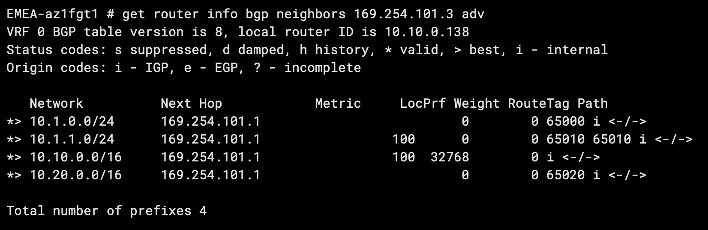

- Routes announced to the TGW from the fortigate instance in AZ2:

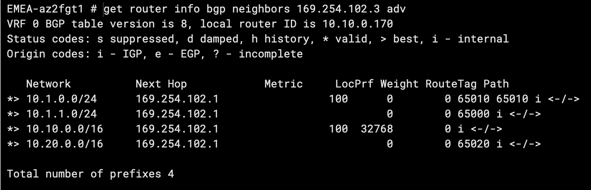

You can see how the prefix `10.1.1.0/24` is announced with an AS path of 65000 from the fortigate in AZ2 and with an AS path of `65010 65010` from the fortigate in AZ1.

> [!NOTE]
> If we wanted traffic balancing using the ECMP capability of the TGW, we would not modify the announcements to it. In these scenarios, asymmetric routing may occur, and we need to configure the Fortigates to handle this type of traffic.

### 7.4 Traffic between SDWAN spokes

- As your colleagues deploy their Fortigates, they will join the SDWAN network, and your spoke will learn new routes to the networks they announce (iBGP network with the HUB acting as a Route Reflector).
- Check connectivity through ADVPN to the networks of your colleagues. Ask a colleague for the IP of their internal server and try to ping it from the Fortigate or from your laboratory server. (E.g., you can ping the test server IP of user 0, 10.1.0.74)
- Verify that a new tunnel is dynamically established.

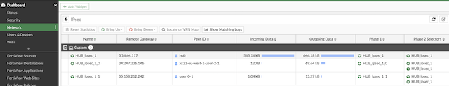

## Lab Completed
Congratulations!

- Final step of the lab, please :)
  ```sh
  $ terraform destroy -auto-approve
  ```

## Support
This a personal repository with goal of testing and demo Fortinet solutions on the Cloud. No support is provided and must be used by your own responsability. Cloud Providers will charge for this deployments, please take it in count before proceed.

## License
Apache License [License](.LICENSE)